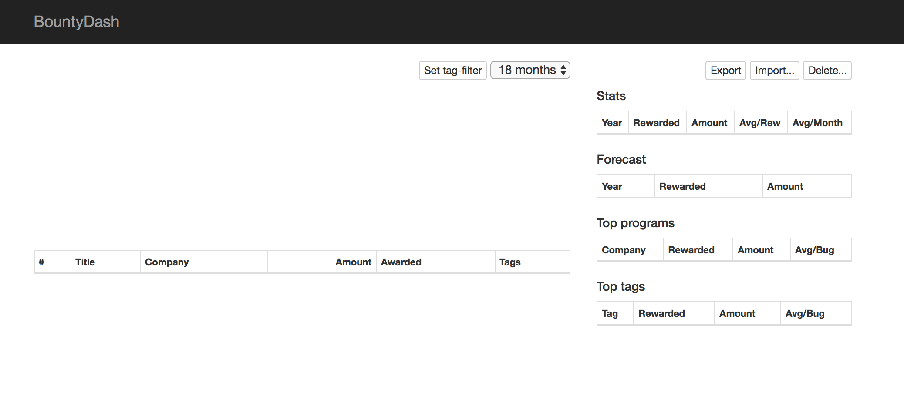
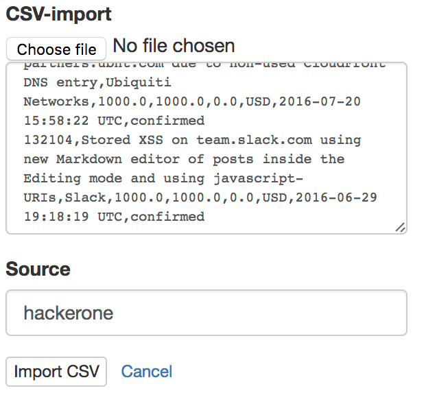
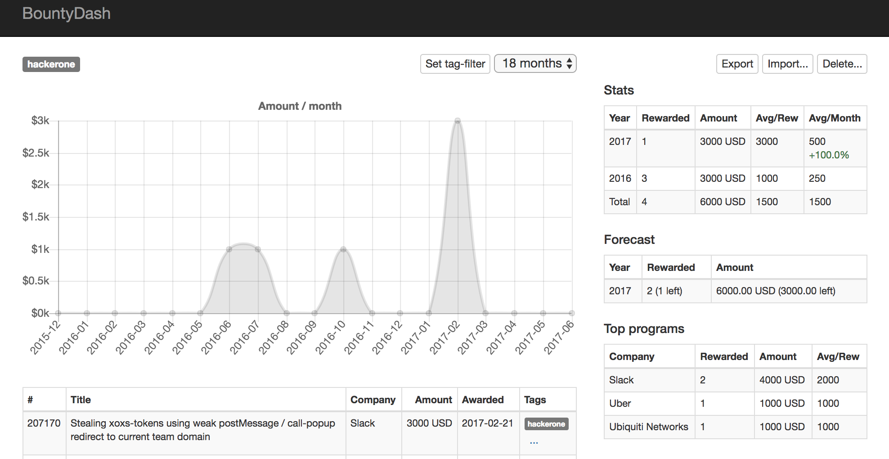
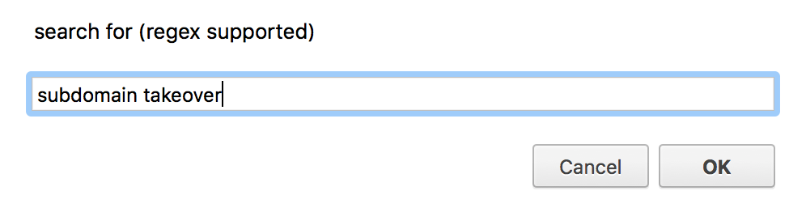
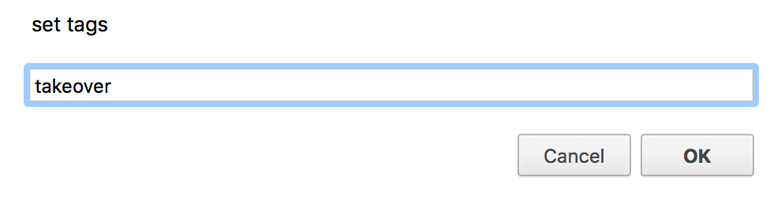
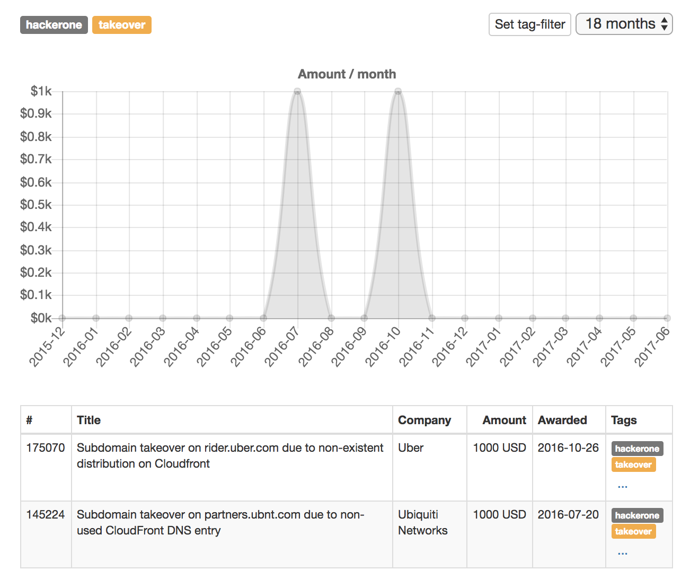
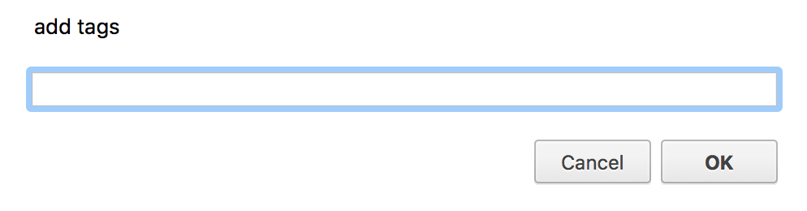
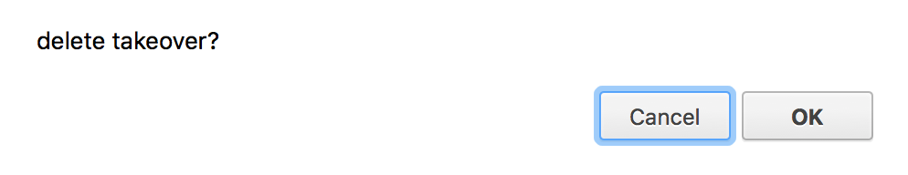
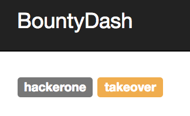

# BountyDash

_This tool was created by [@fransrosen](https://twitter.com/fransrosen) and [@avlidienbrunn](https://twitter.com/avlidienbrunn) to create a better overview of your bug bounty rewards. By tagging all your reports in the tool you're also able to categorize all vulnerability types, plotting up a graph around your activity cross platforms and get forecasts around your future findings. Everything runs locally and there are import scripts you can run to fetch the data from each platform._


## Description

Since we both have submitted quite a bunch of bug bounty reports since 2013, we felt that we had to consolidate how we structured our findings. We both kept spreadsheets with all info, but there had to be a better way.

By just creating a quick import script, saving the data to a JSON-blob, we were able to start calculate some fun statistics about our activity, and also gain insights in how we actually look for bugs.

**Frans:**
> My biggest revelation was that I actually do big pauses of up to 1.5 months long about every 3 months. This is a natural way for me to dig into something and then step out to not get too fed up.

**Mathias:**
> I use BountyDash to make sure my bounty reporting/rewards is in line with my goals, I also tagged every bug that came from automation which made it easy to track those goals too!

## Share knowledge using [#bountydash](https://twitter.com/search?q=bountydash)

If you get something good out of the tool, like our realizations above, we would love if you use the hashtag [#bountydash](https://twitter.com/search?q=bountydash) so we can share the knowledge further.

## Intro

First, yea, we did PHP here! :) The PHP code is not calculating any of the stats, it's only sanitizing and normalizing the data when importing + saving and loading the JSON-file to disk. The following methods are used `import_source`, `delete_source`, `delete_tag`, `add_tags` and `add_tags_from_filter`.

We haven't secured this app in any way (Hello CSRF) so keep this instance for yourself somewhere nice.

## Getting started 

*There's a __Taxonomy__ part below that explains the concept of the naming convention in this app and what everything actually means. If you like, please read that one before you start.*

When you first launch BountyDash it looks sad as a snowflake:



You need to start import reports for it to make sense. Let's start with exporting my rewards from one of the platforms. You can find howto's in the `import/` folder of the repo.

Now I got a CSV-formatted file that looks something like this:

```
report_id,report_title,program_name,total_amount,amount,bonus_amount,currency,awarded_at,status
207170,Stealing xoxs-tokens using weak postMessage / call-popup redirect to current team domain,Slack,3000.0,3000.0,0.0,USD,2017-02-21 23:37:16 UTC,sent
175070,Subdomain takeover on rider.uber.com due to non-existent distribution on Cloudfront,Uber,1000.0,1000.0,0.0,USD,2016-10-26 16:21:16 UTC,sent
145224,Subdomain takeover on partners.ubnt.com due to non-used CloudFront DNS entry,Ubiquiti Networks,1000.0,1000.0,0.0,USD,2016-07-20 15:58:22 UTC,confirmed
132104,Stored XSS on team.slack.com using new Markdown editor of posts inside the Editing mode and using javascript-URIs,Slack,1000.0,1000.0,0.0,USD,2016-06-29 19:18:19 UTC,confirmed
```

Click `Import...` in the top right corner. You're now able to either import a file directly or pasting your CSV-content in the box. You also specify a `source`.



When we import this source now, you will see the chart getting an update and also some stats getting filled:



We can now start tagging our findings to get some more insights.

### Using the tag-filter

In the upper right side of the graph, there's a date-selector for the stats but also button saying `Tag-filter`. This means that you can use a filter of your report's `Title`-field to add a tag to multiple reports.

Let's click on it.

First, it asks us what filter we want to search for. Right now, it only searches in the `Title`-field of each report. This filter support regex:



Then, it asks us what tag we want to add, you can use `,` as a separator if you like to add multiple tags at the same time:



Every report with a title matching the filter will now get the tag, the stats will update and the tag should be visible in the top. Clicking on each tag will select it and update the stats accordingly.



### Adding tags manually

If you like to add tags to a specific report, there's a `...`-button in the `Tags`-column.



### Deleting tags

You can also delete tags in two different ways. Either you want to delete the tag completely, or you want to delete the tag for a specific report. Holding shift-key or cmd-key clicking on the tag will confirm if you like to delete the tag:



Deleting it from the top:



will delete the tag completely. Deleting it from the report list on a specific report will only delete it for that specific report.

## Data structure and dupe detection

The data storage is a simple JSON-file. Before every import of a source we make a backup of this file to make sure that stuff doesn't break when doing the import. 

We use a combination of the following fields from the CSV to create a hash to check if we already have the report when doing an import:

`id`, `status`, `date`, `amount`, `currency`, `program`, `title` and `source`.

(The field `status` is actually always rewritten to `sent` since we noticed rewards was changing status depending on when you imported them) 

We have seen some instances where programs have changed name after a while but it has been on rare occasions. That would create duplicates of the reports since the hash would differ.

What's good about this dupe detection is that it supports multiple rewards on the same report.

Even though the CSV contains more fields, we are only using the ones above. Since we didn't bother to do any *real* CSV parsing, we used some shortcuts to separate the values taking some stuff for granted of the data set getting imported. Our *super awesome* CSV parser does this:

* CSV always begins with a header, ignore it.
* Row begins with ID first.
* Status is next, but we set it to `sent` always anyway.
* Date is next, we hope it's ISO-formatted, might be T-separated or using space, we normalize that.
* Currency is next. (Our dupe checking supports currency, but the stats calculation doesn't yet)
* Ignore the next to columns.
* Total is next. Should be an floating value with dot-separator.
* Program next up. Our bookmarklets doing the CSV now actually removes the occurrence of commas in the program title.
* Title. Might be wrapped with `"`, if so, remove that.

This is not our proudest moment, but it does the job for now.

## Additional features

You can also export the JSON using the export-button.

There's also a `Delete...`-button. This one can be used to delete a specific source. This will actually delete all reports with that source. It's great if you want to clear up and import stuff again from a specific source.

## Taxonomy

* `tag` is a phrase you add to each report. You will be able to filter on these in your stats. 

 Examples: `xss`, `sqli`, `idor`.
* `source` is where the report came from. It works as an additional tag, but will also have its own separate stats. 

 Examples: `hackerone`, `bugcrowd`, `synack`.

* `Company` is the specific program that the reward was given from.
* `Title` is the name of the report that was sent to the company.
* `Report` is the actual row in the data storage, containing info about the bug that was reported to what company and from what source.
* `Amount` is the rewarded amount. We currently do not officially support multi currency (We're open to PRs though!).
* `Awarded` is the date of the reward.
* `Rewarded` is the amount of reports that resulted in a payout. Rewarded `10` for `2017` means you had 10 reports that was rewarded in 2017.
* `Avg/Rew` means Average amount per Reward.
* `Avg/Month` means Average amount per month. This also shows the increased percentage from the year before.

## Support

We currently support the following platforms:

* HackerOne (using CSV-export sent to you via e-mail)
* Bugcrowd (using bookmarklet)
* Synack (using bookmarklet)
* Detectify Crowdsource (through Bugcrowd payments)
* Facebook (through Bugcrowd payments)

The bookmarklets are included in the `import/` folder in the repo.

## Future 

We would love to get some help doing new features. The core concept of this app is a way to consolidate stats for rewards from all platforms, making it easy to gather intel about how you perform. Both to challenge yourself and to learn of patterns around your bug hunting. If you have any ideas following this concept we would love to see some pull requests or feature requests. Remember, we are doing this project on our "free time". :)

Regards,<br />
[@fransrosen](https://twitter.com/fransrosen) and [@avlidienbrunn](https://twitter.com/avlidienbrunn)
